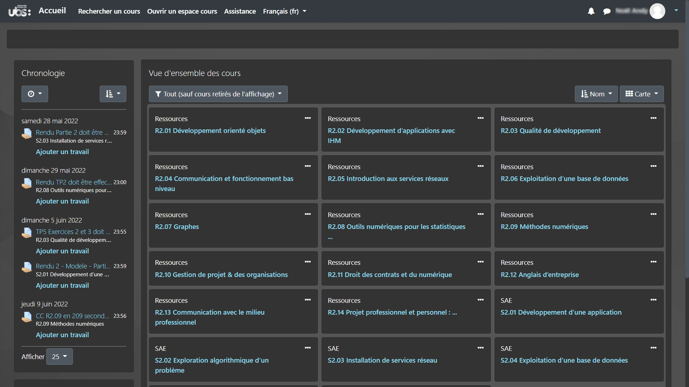

# Dark Moodle

## Installation

Chrome : [Link here](https://chrome.google.com/webstore/detail/dark-moodle/hblgmffbmddipnmjboehgpbpmmmkhdom "Chrome Web Store")

Firefox : [Link here](https://addons.mozilla.org/fr/firefox/addon/moz-dark-moodle/ "Addons Mozilla")

Opera : Currently in moderation

If you want to build it by your own, you can follow this [tutorial](https://developer.chrome.com/docs/extensions/mv3/getstarted/#unpacked)

## Description

Dark Moodle is a web extension that modify the default Moodle style sheet with a darker look, it also add some changes on the UI. This extension was made because every dark mode extension that I tested give a bad render with this website.

## Screenshots

Default Moodle :

Other Dark Mode Extension ([Dark Reader](https://chrome.google.com/webstore/detail/dark-reader/eimadpbcbfnmbkopoojfekhnkhdbieeh?hl=fr "Dark Reader Extension Page")) :

Dark Moodle :

